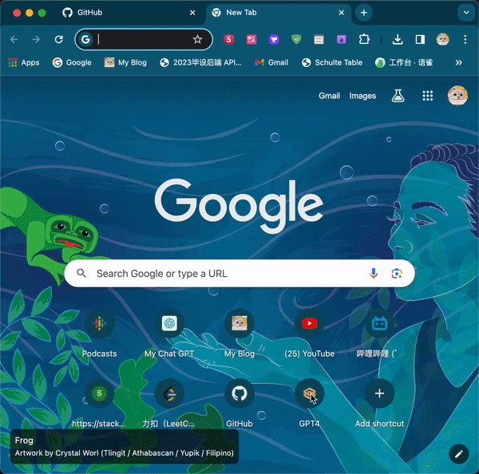

# lmsys-optimize-usage

The `lmsys-optimize-usage` userscript is designed to optimize the user experience on the [LMSYS chat platform](https://chat.lmsys.org/). It introduces several enhancements that streamline the chat interface by removing unnecessary elements, increasing the output token count, and automating the selection of chat settings.

## Display

### Original

### After Effects

## Features

- **Increase Output Token Count**: This script sets the maximum number of output tokens to a higher value (default is 4096), allowing for longer responses.
- **Auto-Switch to Direct Chat**: It automatically switches the interface to direct chat mode.
- **Auto-Switch Model**: This script changes the chat model to "gpt-4-turbo" upon loading the page.
- **Remove Unnecessary Elements**: It removes unwanted notices and components from the chat interface to provide a cleaner user experience.

## Installation

To use the `lmsys-optimize-usage` userscript, you will need a userscript manager such as Tampermonkey or Greasemonkey installed in your browser. Follow these steps to install:

1. Install a userscript manager extension for your browser:
   - [Tampermonkey for Chrome](https://tampermonkey.net/?ext=dhdg&browser=chrome)
   - [Tampermonkey for Firefox](https://tampermonkey.net/?ext=dhdg&browser=firefox)
   - Other browsers may also be supported.

2. Open the userscript manager dashboard and create a new script.

3. Copy the JavaScript code provided above into the new script field.

4. Save the script, ensuring it is enabled in the userscript manager.

5. Navigate to [https://chat.lmsys.org/](https://chat.lmsys.org/) to see the enhancements in action.

## Usage

Once installed, the script will run automatically whenever you visit the LMSYS chat platform. It performs the following actions:

- Sets the maximum number of output tokens.
- Clicks on the direct chat tab.
- Removes specified page elements.
- Selects the "gpt-4-turbo" model from the model dropdown.

The optimizations will take place without any further intervention from the user.

## Notes

- The script is configured to work with the specified elements and IDs in the LMSYS chat platform. Any changes to the website might require updates to the script.
- The default token output count is set to 4096. You can modify this value in the script if needed.
- The script automatically changes the chat model to "gpt-4-turbo," but you can adjust the `changeModel` function call to select a different model.
- The script removes the element with the ID `#notice_markdown` and the component with the ID `#component-93`. You may need to update these selectors if the website's structure changes.
- This script is intended for personal use, and you should use it responsibly and in compliance with the LMSYS chat platform's terms of service.

## Disclaimer

The `lmsys-optimize-usage` userscript is not officially associated with the LMSYS chat platform. It is provided "as is," without warranty of any kind. The author is not responsible for any issues that arise from the use of this script.